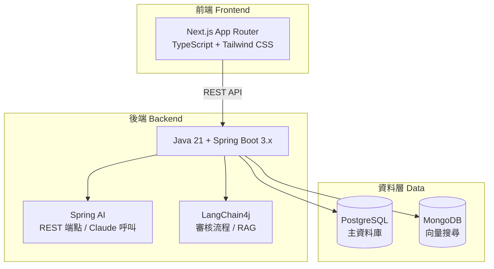

# AgentsGate 專案分析報告

> **分析日期：** 2026-03-03  
> **專案擁有者：** Jackson  
> **BMAD 版本：** 6.0.4

---

## 1. 專案概述

**AgentsGate** 是一個 **AI Skill 與 Sub-Agent 的分享平台**，核心價值主張：

> **上傳一次，適配所有 CLI，下載即用，零設定。**

開發者上傳 Skill 或 Agent 後，平台自動產生各 CLI 的適配檔案。使用者下載後執行安裝腳本，直接在自己慣用的 CLI 工具中使用。

### 支援的 CLI 工具

| CLI | 狀態 |
|-----|------|
| Claude Code | ✅ 支援（含 MCP 設定） |
| GitHub Copilot | ✅ 支援（.agent.md 格式） |
| Gemini CLI | ✅ 支援（不支援獨立 MCP） |
| Kiro CLI | ✅ 支援（含 MCP 設定） |

---

## 2. 技術架構

### 全端技術選型



| 層級 | 技術 |
|------|------|
| **前端** | Next.js (App Router) + TypeScript + Tailwind CSS |
| **後端** | Java 21 + Spring Boot 3.x |
| **AI REST 整合** | Spring AI（REST 端點、Claude 模型呼叫） |
| **AI Agent 編排** | LangChain4j（審核流程、複雜任務編排、RAG） |
| **主資料庫** | PostgreSQL |
| **向量資料庫** | MongoDB（語義搜尋） |
| **ORM** | Spring Data JPA (Hibernate) |
| **認證** | NextAuth.js（前端）+ Spring Security + JWT（後端） |
| **容器化** | Docker + Docker Compose |
| **建置工具** | Maven |

### 後端服務模組架構

```
backend/src/main/java/com/agentsgate/
├── api/                     # REST Controller 層
├── domain/                  # Entity（JPA 資料模型）
├── dto/                     # 請求 / 回應 DTO
├── repository/              # Spring Data JPA Repository
├── service/
│   ├── adapter/             # CLI 適配檔案產生（各 CLI 格式轉換）
│   ├── packaging/           # 下載套件封裝（含安裝腳本產生）
│   ├── review/              # LangChain4j AI 審核 Service
│   ├── search/              # 語義搜尋 Service
│   └── version/             # 版本管理 Service
├── ai/                      # Spring AI + LangChain4j 設定與整合
└── config/                  # Spring Security、DB、CORS 設定
```

---

## 3. 核心功能模組

### 3.1 Skill/Agent 上傳

每個上傳的 Skill 或 Agent 必須提供：
- **必填：** `name`、`type`、`description`、`content`、`usage_examples`、`dependencies`、`tags`、`version`、`author`、`license`、`os_compatibility`
- **選填：** `mcp_spec`（MCP Server 規格）、`cli_overrides`（各 CLI 客製化描述）
- **條件必填：** `changelog`（v1.0.0 起）

### 3.2 AI 審核流程

```
上傳 → AI 初審 (LangChain4j + Claude) → 人工複審 → 發布
```

**AI 初審檢查項目：**
- 必填欄位完整性
- 各 CLI 適配描述品質
- 安全性掃描（不得包含惡意指令或 prompt injection）
- MCP Server 規格格式正確性
- 使用範例可讀性

**審核狀態流轉：**
```
DRAFT → PENDING_AI_REVIEW → PENDING_HUMAN_REVIEW → PUBLISHED / REJECTED
```

### 3.3 CLI 相容性規則

- `mcp_spec` 有值 → Gemini CLI 自動標記為不支援
- 平台在詳細頁顯示各 CLI 的相容狀態標籤
- 下載時只提供使用者所選 CLI 的適配套件

### 3.4 版本管理

- 遵循 SemVer（x.y.z）
- 每次更新需填寫 changelog
- 舊版本保留供查閱，搜尋結果只顯示最新版

---

## 4. BMAD 方法論整合

此專案深度整合了 **BMAD Method v6.0.4**，這是一套完整的 AI 驅動軟體開發方法論框架。

### 已安裝模組

| 模組 | 版本 | 來源 | 說明 |
|------|------|------|------|
| **core** | 6.0.4 | 內建 | 核心平台功能（BMad Master、工作流引擎） |
| **bmm** | 6.0.4 | 內建 | 主要方法論模組（分析、架構、開發、PM、QA 等角色） |
| **bmb** | 0.1.6 | 外部 ([bmad-builder](https://github.com/bmad-code-org/bmad-builder)) | 建構工具（Agent / Module / Workflow 建構與驗證） |
| **cis** | 0.1.8 | 外部 ([bmad-creative-intelligence-suite](https://github.com/bmad-code-org/bmad-module-creative-intelligence-suite)) | 創意智慧套件（腦力激盪、設計思維、創新策略） |
| **tea** | 1.5.0 | 外部 ([bmad-method-test-architecture-enterprise](https://github.com/bmad-code-org/bmad-method-test-architecture-enterprise)) | 測試架構企業版（ATDD、CI/CD、NFR 評估） |

### 已配置 AI Agent 角色（共 21 個）

#### BMM 核心角色
| Agent | 名稱 | 角色 | 能力 |
|-------|------|------|------|
| 📊 analyst | Mary | 商業分析師 | 市場研究、競爭分析、需求引出 |
| 🏗️ architect | Winston | 架構師 | 分散式系統、雲端基礎設施、API 設計 |
| 💻 dev | Amelia | 開發者 | 故事執行、TDD、程式碼實作 |
| 📋 pm | John | 產品經理 | PRD 建立、需求探索、利害關係人對齊 |
| 🧪 qa | Quinn | QA 工程師 | 測試自動化、API 測試、E2E 測試 |
| 🚀 quick-flow-solo-dev | Barry | 快速開發者 | 快速規格建立、精簡實作 |
| 🏃 sm | Bob | Scrum Master | Sprint 規劃、故事準備、敏捷儀式 |
| 📚 tech-writer | Paige | 技術寫手 | 文件撰寫、Mermaid 圖表、標準合規 |
| 🎨 ux-designer | Sally | UX 設計師 | 使用者研究、互動設計、UI 模式 |

#### BMB 建構角色
| Agent | 名稱 | 角色 |
|-------|------|------|
| 🤖 agent-builder | Bond | Agent 建構專家 |
| 🏗️ module-builder | Morgan | 模組建構大師 |
| 🔄 workflow-builder | Wendy | 工作流建構大師 |

#### CIS 創意角色
| Agent | 名稱 | 角色 |
|-------|------|------|
| 🧠 brainstorming-coach | Carson | 腦力激盪教練 |
| 🔬 creative-problem-solver | Dr. Quinn | 問題解決大師 |
| 🎨 design-thinking-coach | Maya | 設計思維教練 |
| ⚡ innovation-strategist | Victor | 創新策略家 |
| 🎨 presentation-master | Caravaggio | 簡報大師 |
| 📖 storyteller | Sophia | 說故事大師 |

#### TEA 測試角色
| Agent | 名稱 | 角色 |
|-------|------|------|
| 🧪 tea | Murat | 測試架構師 |

### 支援的 IDE 適配

已為以下 IDE/CLI 工具產生適配檔案：
- ✅ Claude Code（`.agents/skills/`）
- ✅ Gemini CLI（`.gemini/`）
- ✅ GitHub Copilot（`.github/agents/` + `.github/prompts/`）
- ✅ Antigravity
- ✅ Kiro
- ✅ Kilo（`.kilocode/`）
- ✅ Cline（`.clinerules/`）
- ✅ Codex

---

## 5. 專案目前狀態

### 已存在的內容

| 項目 | 狀態 | 說明 |
|------|------|------|
| **CLAUDE.md** | ✅ 完整 | 詳細的專案規格文件，包含架構、功能、API 格式 |
| **BMAD 方法論** | ✅ 完整安裝 | 5 個模組、21 個 Agent、83+ 個 Prompts |
| **多 IDE 適配** | ✅ 完整 | 8 種 IDE/CLI 工具的適配檔案已產生 |
| **前端程式碼** | ❌ 尚未建立 | `frontend/` 目錄不存在 |
| **後端程式碼** | ❌ 尚未建立 | `backend/` 目錄不存在 |
| **Docker 配置** | ❌ 尚未建立 | `docker-compose.yml` 不存在 |
| **資料庫 Schema** | ❌ 尚未建立 | 需要設計 PostgreSQL + MongoDB |

### 目錄結構現況

```
agents-gate/
├── .agent/                  # Agent 適配（通用）
├── .agents/skills/          # Claude Code 技能（77 個）
├── .claude/                 # Claude Code 設定
├── .clinerules/workflows/   # Cline 適配（4 個工作流）
├── .gemini/                 # Gemini CLI 適配（77 個）
├── .github/
│   ├── agents/              # GitHub Copilot Agent（20 個）
│   ├── prompts/             # GitHub Copilot Prompts（83 個）
│   └── copilot-instructions.md
├── .kilocode/               # Kilo 適配
├── .kiro/                   # Kiro 適配
├── _bmad/                   # BMAD 方法論核心
│   ├── _config/             # 全域配置與清單
│   ├── _memory/             # Agent 記憶
│   ├── bmb/                 # Builder 模組
│   ├── bmm/                 # 方法論模組
│   ├── cis/                 # 創意智慧套件
│   ├── core/                # 核心模組
│   └── tea/                 # 測試架構模組
├── CLAUDE.md                # 專案規格文件
├── .gitignore
└── .kilocodemodes
```

---

## 6. 分析結論與建議

### 📊 總體評估

此專案目前處於 **規劃與工具鏈設定階段**。BMAD 方法論框架已完整安裝並配置，但 **實際的應用程式碼尚未開始開發**。`CLAUDE.md` 中的技術規格文件已相當完善，定義了清晰的架構方向。

### 🎯 下一步建議

> [!IMPORTANT]
> 專案已有完整的規格定義，但缺少實際的前後端程式碼。以下是建議的開發順序。

1. **建立專案文件結構**
   - 初始化 `frontend/`（Next.js 專案）
   - 初始化 `backend/`（Spring Boot 專案）
   - 建立 `docker-compose.yml`

2. **後端優先開發**
   - 設計 PostgreSQL 資料庫 Schema
   - 實作 Domain Entity 與 Repository
   - 建立 REST API Controller
   - 實作 CLI 適配檔案產生 Service

3. **前端開發**
   - 建立 Next.js 專案框架
   - 實作瀏覽/搜尋頁面
   - 實作上傳表單
   - 實作下載套件功能

4. **AI 整合**
   - 整合 Spring AI + LangChain4j
   - 實作 AI 初審 Service
   - 建立語義搜尋功能

### 💡 可利用的 BMAD 工作流

您可以使用已安裝的 BMAD 工作流來加速開發：

| 工作流 | 用途 |
|--------|------|
| `/create-architecture` | 建立詳細的技術架構文件 |
| `/create-epics-and-stories` | 將需求拆分為 Epic 和 User Story |
| `/sprint-planning` | 產生 Sprint 計畫 |
| `/create-story` | 建立可執行的 Story 規格 |
| `/dev-story` | 依照 Story 規格實作程式碼 |
| `/create-prd` | 建立完整的 PRD 文件 |

---

> [!TIP]
> 建議使用 `/create-architecture` 工作流來產生正式的架構設計文件，然後用 `/create-epics-and-stories` 拆分為可執行的開發任務。
